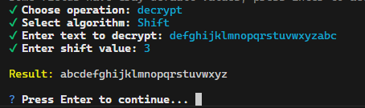

**Permutation Cipher Implementation Report**

**1. Functionality**

The program encrypts and decrypts text using a many ciphers. Users specify an alg to rearrange characters.

Algorithms
- Substitution Cipher
  - Shift Cipher
  - Assuming just for 26 characters in the alphabet
  - Permutation Cipher
- Transposition Cipher
  - Simple Transposition
  - Double Transposition
- Vigenere Cipher

**2. Usage Instructions**

- **Setup:**
  - Ensure Node.js is installed.
  - Install dependencies: `npm install`

- **Execution:**
  - Run the program: `node index.js`
  - Follow prompts to select operation (encrypt/decrypt), input text, define block size, and enter permutation key.

**3. Observations**

- **Input Validation:** Ensuring the permutation key matches the block size and contains unique numbers is crucial.
- **Padding:** Padding text is important, I choose space " " as my padding character.

**4. Directory Structure**
- `Assignment 2 CS 458.md>` contains answers to Task 1 and Task 2.
- `.gitignore`: Specifies files to ignore in version control.
- `index.js`: Main program file.
- `package-lock.json` & `package.json`: Manage dependencies.
- `README.md`: This file

**5. Examples**

**Shift Demo**

**Permutation Demo**

**AES Demo**
CBC - Cipher Block Chaining

**DES Demo**
CBC - Cipher Block Chaining

**3DES Demo**
CFB - Cipher Feedback

